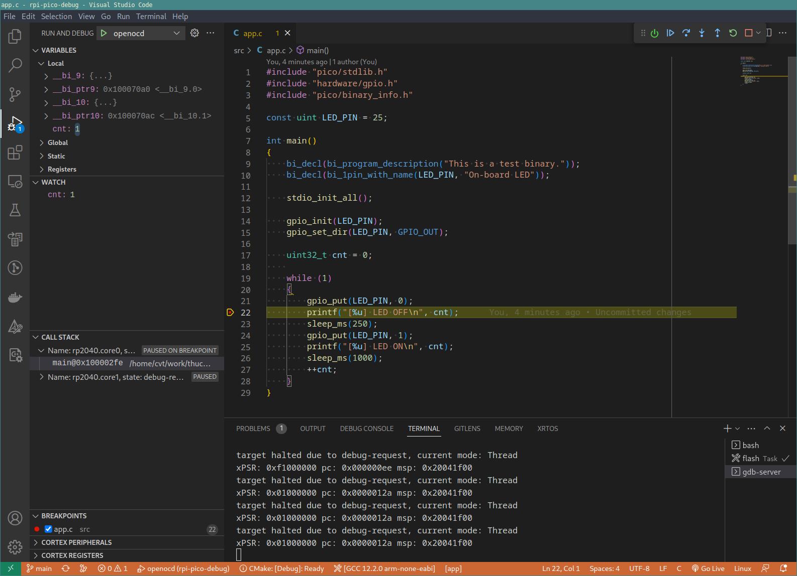
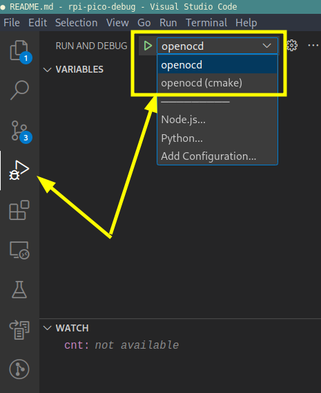
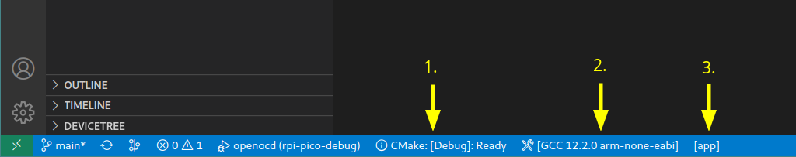
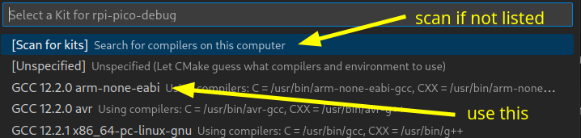
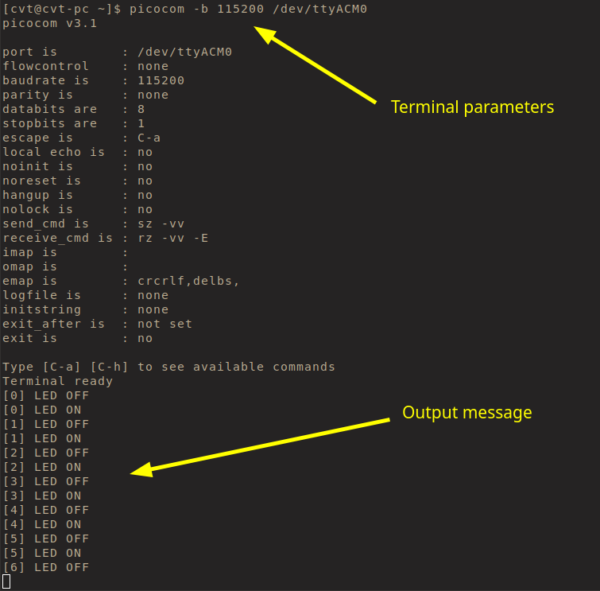
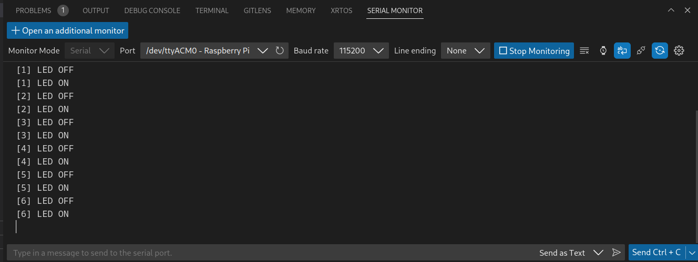

# rpi-pico-debug

## Overview

In this project we will try to use the open source `Picoprobe` software 
(https://github.com/raspberrypi/picoprobe) to transform a low-cost RP2040 
evaluation board into a full features SWD debugger.

The hardware used in this demo is based on the `rpi-pico-probe` project made
by `thucon` (https://github.com/thucon/rpi-pico-probe) and is available
under the CERN Open Hardware Licence.

Below is the end result of this guide shown. Full debug capabilities through
`vscode` :-)



## Getting started

### Install pico sdk

The following procedure describes how the Pico SDK is installed. For reference
the guide is more a less a modified copy of Chapter 2 in the official
getting started guide: https://datasheets.raspberrypi.com/pico/getting-started-with-pico.pdf

For `Ubuntu` or `Debian` users do

    sudo apt install git cmake gcc-arm-none-eabi libnewlib-arm-none-eabi build-essential libstdc++-arm-none-eabi-newlib

For `Arch` users do

    sudo pacman -S git cmake arm-none-eabi-binutils arm-none-eabi-gcc arm-none-eabi-gdb arm-none-eabi-newlib base-devel

Next install the sdk repo (all sdk artifacts are installed in `$HOME/pico`)

    # make pico root folder
    cd ~
    mkdir pico
    cd pico

    # clone sdk and examples
    git clone -b master https://github.com/raspberrypi/pico-sdk.git
    cd pico-sdk
    git submodule update --init
    cd ..
    git clone -b master https://github.com/raspberrypi/pico-examples.git

Add the `pico-sdk` path to the `$PATH` variable. This is done in `.profile`

    vim ~/.profile
    export PICO_SDK_PATH=$HOME/pico/pico-sdk

If you don't want to put `PICO_SDK_PATH` in `.profile` you can set it 
temporarily by writing `export PICO_SDK_PATH=$HOME/pico/pico-sdk` in the 
terminal

To check if the installation was fine you can try to build all the examples (it
takes 1-2 mins on a relatively new labtop pc).

    export PICO_SDK_PATH=$HOME/pico/pico-sdk
    cd ~/pico/pico-examples
    mkdir build
    cd build
    cmake ..
    make -j4

### Prepare rpi-pico-probe hardware

To update the `Picoprobe` device on the `rpi-pico-probe` hardware we can 
either choose to use a pre-compiled version of the firmware - or building the 
firmware directly from the sources.

#### picoprobe (pre-compiled)

Go to this site and download the UF2 file

    https://www.raspberrypi.com/documentation/microcontrollers/raspberry-pi-pico.html#debugging-using-another-raspberry-pi-pico

Upload the UF2 file to target (using the `BOOTSEL` button)

When uploaded and successfully executed you should see it in the usb device list

    $ lsusb
    ...
    Bus 003 Device 011: ID 2e8a:000c Raspberry Pi Picoprobe CMSIS-DAP
    ...

#### picoprobe (self-compiled)

**NOTE!** Requires the `PICO_SDK_PATH` environment variable to be set.

Download sources and build it

    export PICO_SDK_PATH=$HOME/pico/pico-sdk
    cd ~/pico
    git clone --recursive https://github.com/raspberrypi/picoprobe.git
    cd picoprobe
    mkdir build
    cd build
    cmake ../
    make -j4

When compilation has finalised you should see a `picoprobe.uf2` in the `build`
directory.

Upload the `UF2` file to target (using the BOOTSEL button)

When uploaded and successfully executed you should see it in the usb device list

    $ lsusb
    ...
    Bus 003 Device 011: ID 2e8a:000c Raspberry Pi Picoprobe CMSIS-DAP
    ...

### Build OpenOCD with rpi pico support

The official `OpenOCD` tool doesn't support `Picoprobe` as a SWD probe. Instead
we have to build a modified version.

First install dependencies (`Ubuntu` or `Debian` users only)

    sudo apt install automake autoconf build-essential texinfo libtool libftdi-dev libusb-1.0-0-dev pkg-config

Download sources and build it

    cd ~/pico
    git clone https://github.com/raspberrypi/openocd.git --branch=rp2040 --depth=1
    cd openocd
    ./bootstrap
    ./configure --enable-picoprobe --disable-werror
    make

### Create udev rule

Create the following udev rules file

    sudo vim /etc/udev/rules.d/60-openocd-picoprobe.rules

And add to it

    ATTRS{idVendor}=="2e8a", ATTRS{idProduct}=="000c", MODE="660", GROUP="plugdev", TAG+="uaccess"

**NOTE!** The above `ATTRS{idVendor}` and `ATTRS{idProduct}` must match the values 
found with `lsusb` after installing `picoprobe.uf2` on the RP2040 device.

## Test application

As part of the project comes a test application (`src/app.c`) and a set of 
configuration files for `vscode` and the pico sdk (`CMakeLists.txt` and 
`pico_sdk_import.cmake`)

The `pico_sdk_import.cmake` is copied from the current version of the pico sdk.
This version of the file might change at a later stage - but can be easily 
updated by copying it from the `pico-sdk` folder

    cp $HOME/pico/pico-sdk/external/pico_sdk_import.cmake .

### vscode setup

Install `vscode` (`Ubuntu` or `Debian` users)

    # add code package repository
    sudo apt-get install wget gpg
    wget -qO- https://packages.microsoft.com/keys/microsoft.asc | gpg --dearmor > packages.microsoft.gpg
    sudo install -D -o root -g root -m 644 packages.microsoft.gpg /etc/apt/keyrings/packages.microsoft.gpg
    sudo sh -c 'echo "deb [arch=amd64,arm64,armhf signed-by=/etc/apt/keyrings/packages.microsoft.gpg] https://packages.microsoft.com/repos/code stable main" > /etc/apt/sources.list.d/vscode.list'
    rm -f packages.microsoft.gpg

    # update apt and install code
    sudo apt install apt-transport-https
    sudo apt update
    sudo apt install code


Install `vscode` (`Arch`)

    yay -S visual-studio-code-bin

Once the install has completed, install the following extensions (also from 
`bash` command)

    code --install-extension marus25.cortex-debug
    code --install-extension ms-vscode.cmake-tools
    code --install-extension ms-vscode.cpptools

Finally open `vscode` in the repo root

    code .

### Repo files

The interesting files for the project are listed below

```
├── CMakeLists.txt
├── pico_sdk_import.cmake
├── src
│   └── app.c
└── .vscode
    ├── c_cpp_properties.json
    ├── launch.json
    ├── settings.json
    └── tasks.json
```

* `CMakeLists.txt`: Define how to build the application with `cmake` which is 
  the default to use by the `pico-sdk`. In the `CMakeLists.txt` we have enabled
  that all `printf()` are transmitted over `uart` and `usb`.
* `pico_sdk_import.cmake`: Mandatory component from the `pico-sdk`. It can be 
  found here: `$HOME/pico/pico-sdk/external/pico_sdk_import.cmake`.
* `src/app.c`: Test application written in C. Does the most exciting stuff by 
  toggling the onboard LED and write a state message to the `uart` :-)
* `.vscode/c_cpp_properties.json`: Config file for the `ms-vscode.cpptools` 
  extension
* `.vscode/launch.json`: Configuration for debug session. 
* `.vscode/settings.json`: Project settings (mostly configuration for the 
  `ms-vscode.cmake-tools` extension).
* `.vscode/tasks.json`: Various task objects, that can either be executed 
  manually with `ctrl + shift + p` then go to menu `Tasks: Run Task` - or by 
  using them via `launch.json` sessions to automatically pre-compile before 
  debugging.

### Start debugging

From the `.vscode/launch.json` we have defined 2 debug targets:

* `openocd`
* `openocd (cmake)`

This can be seen from the `vscode` debug menu below



The `openocd` is a custom debug target, which relies on `preLaunchTask` commands 
to execute any build commands or other setup action before starting the debug
session.

The `openocd (cmake)` is using the `cmake` build system. This is using a lot of 
the features coming from the `ms-vscode.cmake-tools` extension. In the 
`settings.json` file the environment for the extension is configured.

The `openocd (cmake)` is (maybe) easier to use from the built in GUI features 
of `vscode` - but is (maybe) also harder to customize or extend.

What you choose is a matter of personal preference - BUT don't mix builds from 
one target to another. So stick to the one you prefer. Or if you want to switch 
then run the `clean` task (or remove the `build` directory) before you switch.

#### Using "openocd" target

The `openocd` target has its build configuration set to `Debug` per default. 
This means that it builds extra debug symbols into the binary to help GDB.

To change to `Release` configuration go to the `launch.json` and change the 

    "preLaunchTask": "openocd (debug)",

to

    "preLaunchTask": "openocd",

It might be needed to do run a `clean` task before switching between `Debug` 
and `Release` configurations.

#### Using "openocd (cmake)" target

The `openocd (cmake)` uses the `ms-vscode.cmake-tools` extension to configure 
itself.

In the bottom of the `vscode` window are 3 settings that should be configured:

1. Click `CMake:` and pick `Debug` or `Release` to choose the build configuration.
2. Next to `CMake` is the `toolchain` picker. Here choose `arm-none-eabi` (if it 
   is not listed you can press `[Scan for kits]` in the dropdown).
3. Finally you can pick the executable (here called `app`). Normally this is 
   auto-detected by `cmake` - but if you have multiple executables you can
   pick the one you want to build and test.





### Debug session 

When debug session is started the following happens:

* Sources are recompiled (if needed)
* Target RP2040 is flashed (via SWD and `OpenOCD`)
* A GDB server is started and The GDB session is integrated into `vscode` directly

If all goes well when the debug session will look something like below.


### terminal output

The `Picoprobe` software both implements the USB -> SWD interface, but also 
implements an USB -> COM port interface.

So while we debug over SWD we can also get terminal messages printed. This is
a very handy feature.

On Linux the `Picoprobe` software create the following device

    /dev/ttyACM0

By using a terminal program we can sniff the messages. Below `picocom` is used



To get terminal output directly in `vscode` the `Serial Monitor` extension can be 
used. From bash run

    code --install-extension ms-vscode.vscode-serial-monitor

Next open the new `SERIAL MONITOR` tab in `vscode`. Here the port, baud rate, 
parity etc. can be picked. Click "Start Monitoring" when ready. The output 
should look similar to the picture below.



**NOTE** Before you can use the serial device (`/dev/ttyACM0`) as non-root user
on Ubuntu/Debian, you have to be part of the `dialout` group (or `uccp` group 
on Arch):

    # Ubuntu / Debian
    sudo usermod -a -G dialout $USER

    # Arch
    sudo usermod -a -G uucp $USER

Alternatively a `udev` rule can be made (THIS HAS NOT BEEN TESTED!):

    vim /etc/udev/rules.d/50-usb_serial.rules

    # file content
    KERNEL=="ttyUSB[0-9]*",MODE="0666"
    KERNEL=="ttyACM[0-9]*",MODE="0666"

## Issues and todo


## Acknowledgment

Big thanks to the Raspberry PI project for making the software turning the low-
cost RPI PICO into an invaluable debugging tool.

Also a big thanks to the OpenOCD community for their work on this project!

## Links

* https://datasheets.raspberrypi.com/pico/getting-started-with-pico.pdf
* https://datasheets.raspberrypi.com/pico/raspberry-pi-pico-c-sdk.pdf
* https://www.digikey.be/en/maker/projects/raspberry-pi-pico-and-rp2040-cc-part-2-debugging-with-vs-code/470abc7efb07432b82c95f6f67f184c0